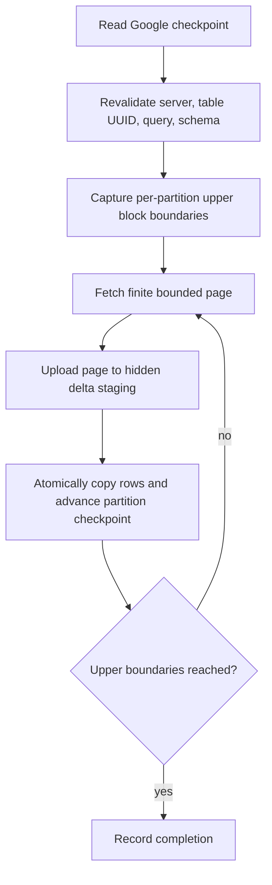

# Append refresh

Append refresh is an opt-in mode for immutable inserted rows. Updates and deletes are out of scope; run a full refresh when they must be reflected.

## Availability

Append mode is shown only when all checks pass:

- configured feature enabled;
- ClickHouse version is at least the configured minimum, initially `26.8`;
- direct `MergeTree` or `ReplicatedMergeTree` source;
- stable table UUID;
- persistent `_block_number` and `_block_offset` available;
- finite ordinary SELECT;
- validated append-compatible query shape;
- destination checkpoint valid.

Version gating is necessary but not sufficient. Runtime capability probes are authoritative.

`SELECT ... STREAM` is explicitly out of scope.

## Eligible query shape

Allow deterministic projection, aliases, typed parameters, optional filters, and WHERE predicates over one direct source table.

Reject joins, views, `FINAL`, aggregation, `GROUP BY`, `DISTINCT`, window functions, `UNION`, table functions, business `LIMIT`, changing top-N semantics, and arbitrary query rewriting.

The binding pins table UUID, query snapshot, query hash, schema hash, and filter parameter values. Changing the source subset requires a full refresh.

## Cursor

Commit position is per partition:

```json
{
  "partitions": {
    "202607": {
      "blockNumber": "18401",
      "blockOffset": "982"
    }
  }
}
```

All values are decimal strings. Rows are complete but not globally ordered across partitions. Process partitions in deterministic `partition_id` order and rows within a partition in `(_block_number, _block_offset)` order.

## Refresh procedure



Each page query filters after the stored `(blockNumber, blockOffset)`, stops at the captured upper block, orders by commit position, and applies a bounded limit. Cursor columns are technical and need not appear in the visible sheet.

## Google commit invariant

For each page, copying rows to the exact live destination and advancing that partition checkpoint occur in the same final Google structural batch. Never advance the checkpoint independently of the corresponding rows.

## Initial population

- **Export existing rows, then append**: default. Use the cursor-aware bounded path for history.
- **Append future rows only**: capture current upper boundaries without exporting history.

## Invalidation

Require an explicit full refresh when server capability, table UUID, query hash, schema, parameters defining the source subset, managed row count, or checkpoint validity changes. Never silently fall back.

## Concurrency

Use an advisory lease and generation check. Re-read generation immediately before each commit and abort when another refresh advanced it. Strict distributed locking between collaborators is not promised.
