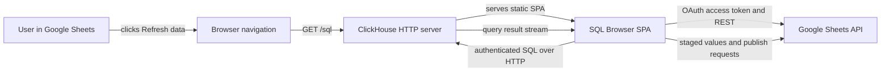
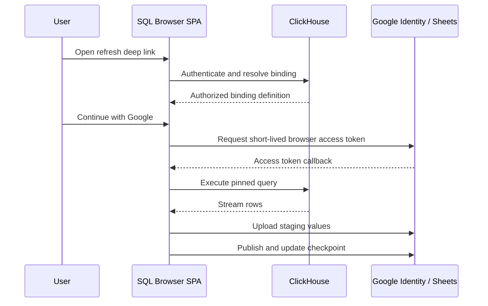

# Architecture and data flow

## Runtime architecture

Altinity SQL Browser remains a static single-page application served by ClickHouse. It does not listen on a port, receive Google callbacks, or add an application server.



The refresh URL uses an opaque binding identifier in the fragment:

```text
https://clickhouse.example.com/sql#sheet-refresh=<binding-id>
```

The fragment is interpreted by the SPA and is not sent to ClickHouse by the browser. It contains no SQL, parameters, credentials, or spreadsheet contents.

## Binding resolution

The SPA resolves the opaque identifier through a deployment-configured ClickHouse binding table using the current authenticated ClickHouse identity. The latest append-only binding version contains the spreadsheet identity, managed sheet IDs, pinned query snapshot, parameter policy, limits, and refresh mode.

## Authentication boundaries



ClickHouse authentication authorizes query execution and binding access. Google authentication authorizes spreadsheet modification. Neither identity implies the other.

## Data path

```text
ClickHouse response stream
        ↓
SQL Browser JavaScript memory
        ↓
Google Sheets REST API
```

Data does not pass through an Altinity application backend.

## Source-of-truth hierarchy

- ClickHouse binding table: durable binding definition and versions.
- Google hidden state sheet: destination commit state and append checkpoint.
- Managed data sheet: last committed exported rows.
- Local workspace: navigation convenience and editing source, not the durable refresh authority.

## Refresh entry and completion

When SQL Browser is closed, the spreadsheet remains usable with its last committed data. Nothing refreshes in the background. The control worksheet hyperlink launches a new SPA instance, which resolves, authenticates, executes, uploads, publishes, and terminates the refresh workflow. The completion screen links back to the spreadsheet and source query.
